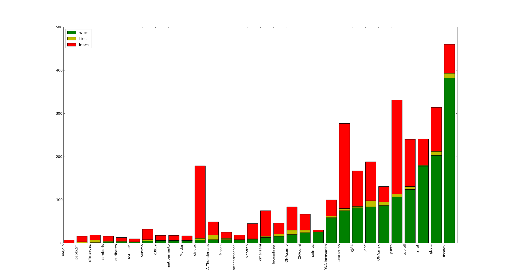
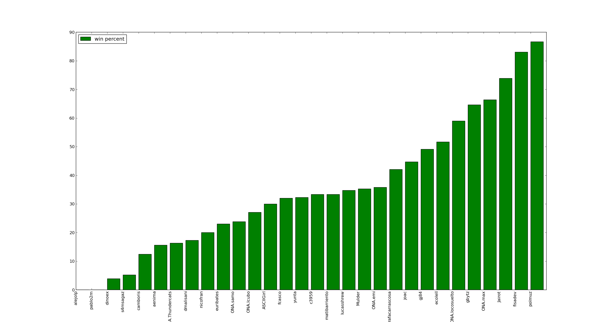
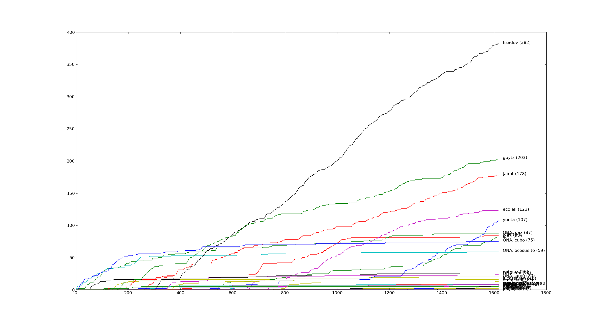
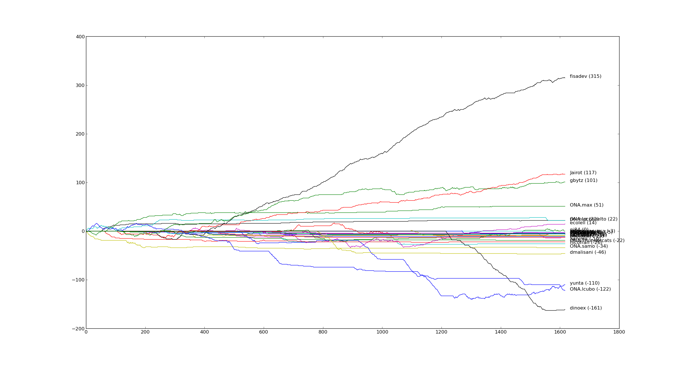
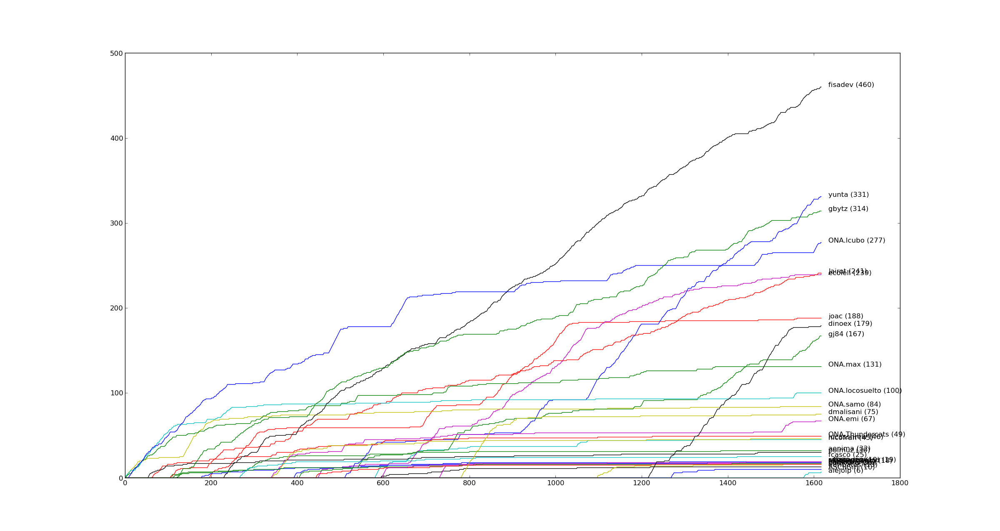
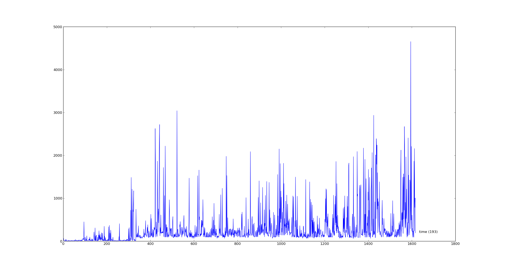
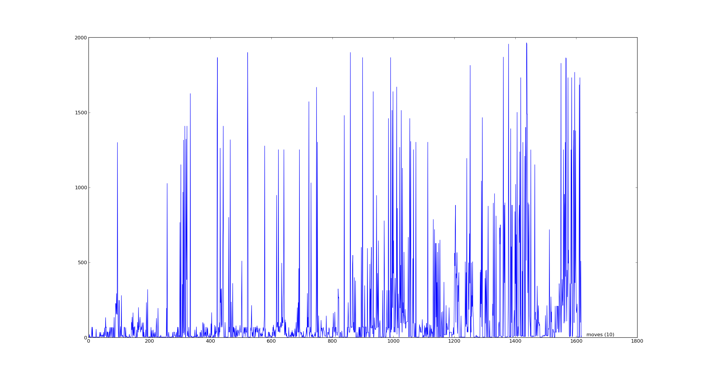
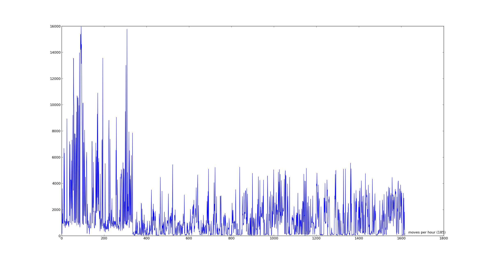

Pytron - estadísticas
=====================

(gráficos sacados con ``stats.py``)

Resultados por bot
------------------

Lo primero que podemos ver son la cantidad de partidos ganados, empatados y perdidos por cada bot.
Ordenando de menos a más partidos ganados, el gráfico se ve así:

Pero esto está bastante sesgado por la cantidad de partidos que cada bot jugó. Sería interesante ver
también qué porcentaje de partidos ganó cada bot, en relación a la cantidad de partidos que jugó, como 
para tener una idea más real de su "efectividad".

Resultados a lo largo del tiempo
--------------------------------

También es interesante ver cómo los bots llegaron a esos valores, ya que la tabla de posiciones fue 
variando bastante a lo largo del tiempo.

Los datos del json que la web daba no indican quién fue el desafiante y quién el desafiado en cada 
uno de los matches, por lo que no podemos armar históricos de sus puntajes. Pero sí podemos sacar
algunas otras cosas.

Lo primero que podemos ver es la cantidad de partidos ganados de cada bot, a lo largo del tiempo 
(cada partido ganado suma 1 punto en el gráfico, y el eje X representa todos los matches jugados, en
el orden en que fueron jugados).

Pero eso no se ve afectado por los partidos perdidos. Podemos intentar agregar esa info en un nuevo
gráfico, en el que cada partido ganado suma un punto, y cada partido perdido resta un punto. Cambia
bastante:

(recuerden que histórico de puntajes reales no podemos tener, por falta de info de desafiante/desafiado)

Y está bueno ver un histórico de cantidad de partidos jugados (cada partido jugado suma 1, sin importar
el resultado):

En este gráfico se notan cosas como personas que tuvieron rachas de interés y después abandonaron sus bots, 
personas que de alguna manera nunca se alejaron de la computadora y siempre siguieron desafiando (hack! hack!),
y personas más normales con perídos de juego y períodos de dejar el bot para ir a vivir u otras cosas poco
importantes.

Duración de los partidos
------------------------

Finalmente, podemos sacar algunos gráficos de la duración de los partidos, que se puede medir de dos formas:

Por tiempo:

O por cantidad de movimientos:

En el primer gráfico (tiempos) se ve muy claro que en un momento dado los tiempos de todos los matches, incluso los 
más cortos, subió (más o menos en la partida 300). Una primera teoría podría ser que se debe a que los bots mejoraron, haciendo matches más largos
porque morían no tan tempranamente. Peeeero, en el gráfico de cantidad de movimientos no se ve ese salto brusco. Se
nota que a lo largo del tiempo los bots van mejorando y haciendo partidas con más movimientos, pero no se ve el salto
de un momento a otro como en el de tiempos. Tiene que ser otra cosa.

Metamos un poco más de estadísticas: "velocidad" de ejecución de los partidos. Tenemos el tiempo, tenemos la cantidad
de movimientos, hacemos una operación y ahora tenemos la cantidad de movimientos por hora a la que ese partido se 
ejecutó.

Graficamos entonces la velocidad de las partidas:

Y acá se ve clarísimo que en ese punto dado, la velocidad cayó. Cuándo fue ese punto? Es la división entre partidas
"en pycon" y partidas "post pycon". Adivino entonces que lo que cambió fue el server que corría las partidas. El de
pycon era dedicado, y el de post-pycon probablemente haya sido una virtual. Onapsis dirá :)

